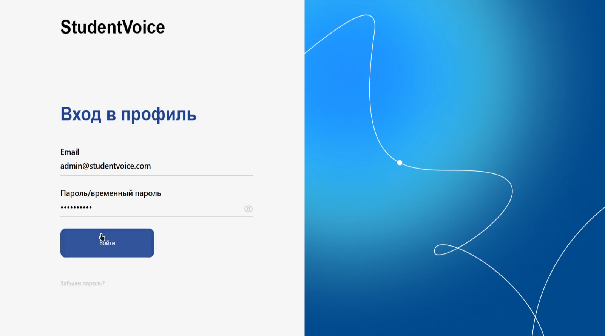
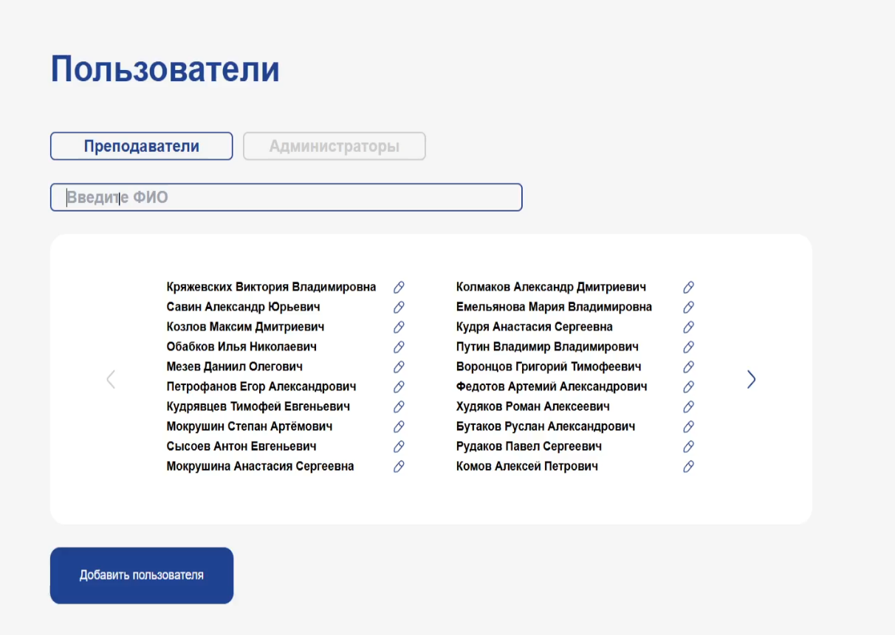
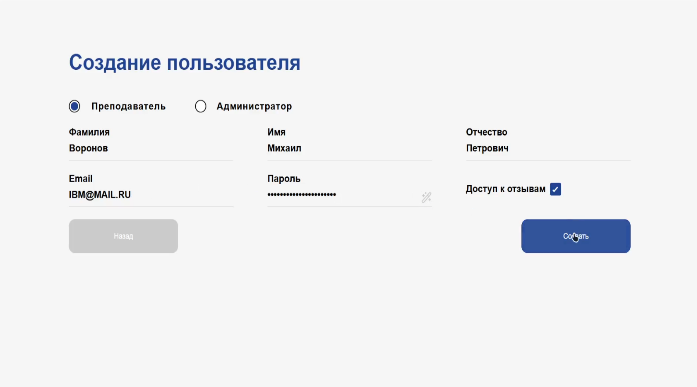
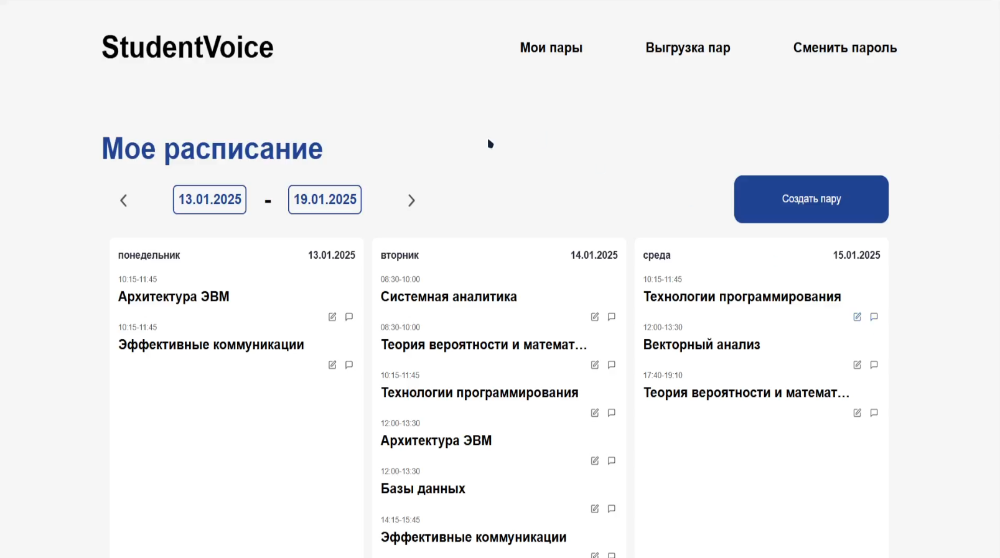
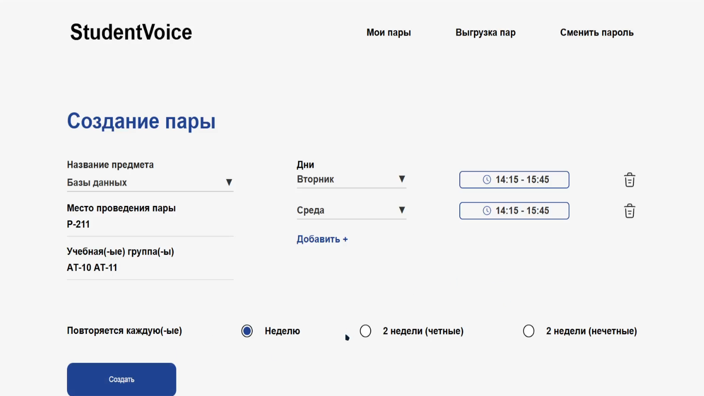
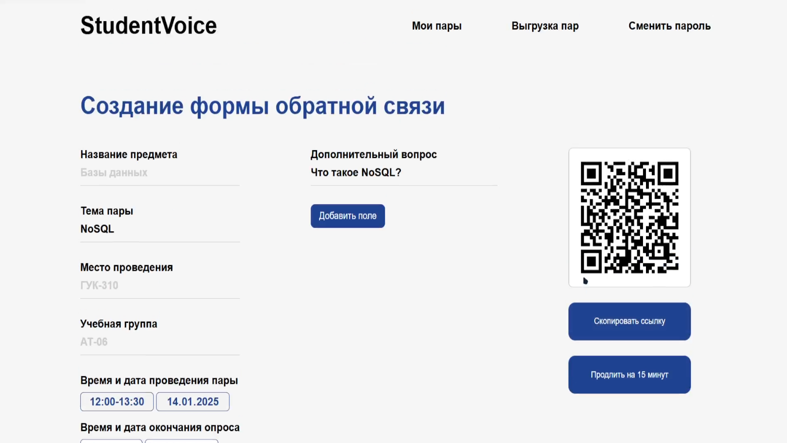
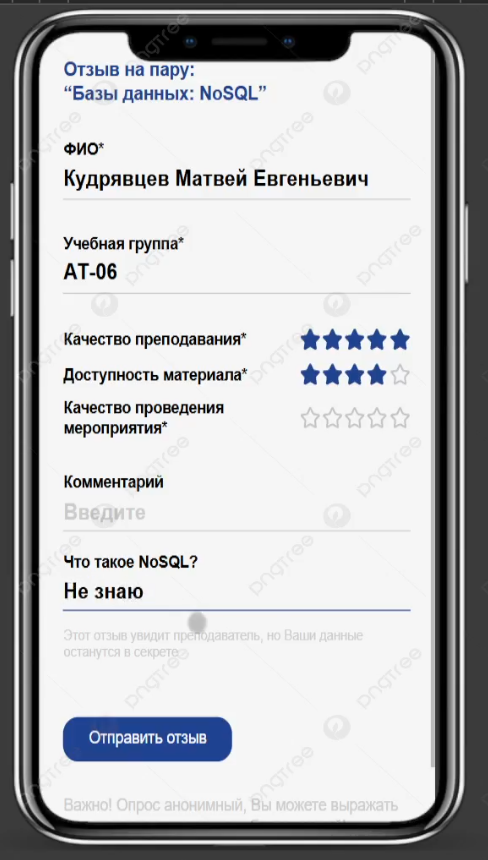

# Student Voice

Student Voice — это веб-платформа для сбора и анализа обратной связи от студентов о проведенных учебных занятиях. Система помогает преподавателям и администраторам улучшать образовательный процесс, анализируя отзывы и метрики.

## Основные функции

### Для администраторов:
- Создание и управление учетными записями пользователей (администраторы, преподаватели).
- Просмотр отзывов и метрик (CSAT, CDSAT, CSI, CES) по преподавателям, предметам и временным промежуткам.
- Формирование и выгрузка отчетов о посещаемости и результатах анкетирования в формате Excel.

### Для преподавателей:
- Управление расписанием занятий: добавление, редактирование и удаление пар.
- Создание форм обратной связи с кастомными вопросами.
- Генерация QR-кодов для перехода студентов на формы.
- Просмотр результатов анкетирования: анонимные отзывы, оценки, посещаемость.

### Для студентов:
- Заполнение форм обратной связи через QR-код или ссылку.
- Оценка занятий по основным критериям (качество преподавания, доступность материала, качество проведения).
- Анонимность отзывов.

## Стек технологий

- **Backend**: FastAPI, PostgreSQL
- **Frontend**: React.js
- **Контейнеризация**: Docker
- **Интеграции**: SMTP для отправки писем, генерация QR-кодов
- **Разработка и управление проектом**: Git, Docker Compose

## Установка и запуск

1. Клонируйте репозиторий:

   ```bash
   git clone https://github.com/ksiim/student-voice
   cd student-voice
   ```

2. Убедитесь, что у вас установлены Docker и Docker Compose.

3. Создайте .env файл в корневой директори, пример файла:
   
   ```# Domain
   # This would be set to the production domain with an env var on deployment
   # used by Traefik to transmit traffic and aqcuire TLS certificates
   DOMAIN=localhost
   # To test the local Traefik config
   # DOMAIN=localhost.tiangolo.com
   
   # Used by the backend to generate links in emails to the frontend
   FRONTEND_HOST=http://localhost:5173
   # In staging and production, set this env var to the frontend host, e.g.
   # FRONTEND_HOST=https://dashboard.example.com
   
   # Environment: local, staging, production
   ENVIRONMENT=local
   
   PROJECT_NAME="Full Stack FastAPI Project"
   STACK_NAME=full-stack-fastapi-project
   
   # Backend
   BACKEND_CORS_ORIGINS="http://localhost,http://localhost:5173,https://localhost,https://localhost:5173,http://localhost.tiangolo.com"
   SECRET_KEY=changethis
   FIRST_SUPERUSER=admin@example.com
   FIRST_SUPERUSER_PASSWORD=changethis
   
   # Emails
   SMTP_HOST=
   SMTP_USER=
   SMTP_PASSWORD=
   EMAILS_FROM_EMAIL=info@example.com
   SMTP_TLS=True
   SMTP_SSL=False
   SMTP_PORT=587
   
   # Postgres
   POSTGRES_SERVER=localhost
   POSTGRES_PORT=5432
   POSTGRES_DB=app
   POSTGRES_USER=postgres
   POSTGRES_PASSWORD=changethis
   
   SENTRY_DSN=
   
   # Configure these with your own Docker registry images
   DOCKER_IMAGE_BACKEND=backend
   DOCKER_IMAGE_FRONTEND=frontend
   ```

5. Выполните:

   ```bash
   docker-compose build
   ```

6. Запустите проект:

   ```bash
   docker-compose watch
   ```

7. Откройте [http://localhost:5173](http://localhost:5173) для доступа к фронтенду.

8. Доступ в аккаунт админа:

   ```Почта: admin@studentvoice.com
   Пароль: qwerty123
   ```

## Примеры работы системы

### Вход в систему


### Управление пользователями (администратор)


### Создание пользователя (администратор)


### Главная страница (преподаватель)


### Создание пары (преподаватель)


### Редактирование формы (преподаватель)


### Результаты анкетирования (преподаватель)


### Заполнение формы обратной связи студентом


## Архитектура системы

Платформа построена по принципу клиент-серверной архитектуры. Основные компоненты:

- **Frontend**: Обеспечивает взаимодействие с пользователем через веб-интерфейс.
- **Backend**: Обрабатывает бизнес-логику, управляет базой данных и отвечает за API.
- **База данных**: PostgreSQL используется для хранения данных о пользователях, парах, результатах опросов и метриках.

## Команда разработки

- **Кряжевских Виктория** — дизайнер и аналитик.
- **Савин Александр** — тимлид.
- **Козлов Максим** — backend-разработчик.
- **Кудрявцев Матвей** — frontend-разработчик.

## Статус проекта

На данный момент платформа готова к использованию и удовлетворяет требованиям заказчика. В планах:
- Реализация автоматической выгрузки данных из Modeus.
- Расширение аналитики и интеграция метрик.

---

**Student Voice** — шаг в будущее образования!
