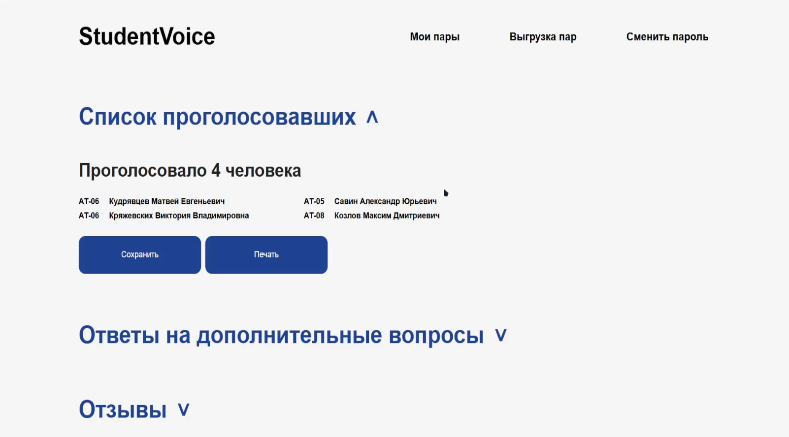

# Student Voice

Student Voice — это веб-платформа для сбора и анализа обратной связи от студентов о проведенных учебных занятиях. Система помогает преподавателям и администраторам улучшать образовательный процесс, анализируя отзывы и метрики.

## Основные функции

### Для администраторов:
- Создание и управление учетными записями пользователей (администраторы, преподаватели).
- Просмотр отзывов и метрик (CSAT, CDSAT, CSI, CES) по преподавателям, предметам и временным промежуткам.
- Формирование и выгрузка отчетов о посещаемости и результатах анкетирования в формате Excel.

### Для преподавателей:
- Управление расписанием занятий: добавление, редактирование и удаление пар.
- Создание форм обратной связи с кастомными вопросами.
- Генерация QR-кодов для перехода студентов на формы.
- Просмотр результатов анкетирования: анонимные отзывы, оценки, посещаемость.

### Для студентов:
- Заполнение форм обратной связи через QR-код или ссылку.
- Оценка занятий по основным критериям (качество преподавания, доступность материала, качество проведения).
- Анонимность отзывов.

## Стек технологий

- **Backend**: FastAPI, PostgreSQL
- **Frontend**: React.js
- **Контейнеризация**: Docker
- **Интеграции**: SMTP для отправки писем, генерация QR-кодов
- **Разработка и управление проектом**: Git, Docker Compose

## Установка и запуск

1. Клонируйте репозиторий:

   ```bash
   git clone https://github.com/your-username/student-voice.git
   cd student-voice
   ```

2. Убедитесь, что у вас установлены Docker и Docker Compose.

3. Запустите проект:

   ```bash
   docker-compose watch
   ```

5. Откройте [http://localhost:5173](http://localhost:5173) для доступа к фронтенду.

## Примеры работы системы

### Вход в систему


### Управление пользователями (администратор)


### Создание пользователя (администратор)


### Главная страница (преподаватель)


### Создание пары (преподаватель)


### Редактирование формы (преподаватель)


### Результаты анкетирования (преподаватель)


### Заполнение формы обратной связи студентом


## Архитектура системы

Платформа построена по принципу клиент-серверной архитектуры. Основные компоненты:

- **Frontend**: Обеспечивает взаимодействие с пользователем через веб-интерфейс.
- **Backend**: Обрабатывает бизнес-логику, управляет базой данных и отвечает за API.
- **База данных**: PostgreSQL используется для хранения данных о пользователях, парах, результатах опросов и метриках.

## Команда разработки

- **Кряжевских Виктория** — дизайнер и аналитик.
- **Савин Александр** — тимлид.
- **Козлов Максим** — backend-разработчик.
- **Кудрявцев Матвей** — frontend-разработчик.

## Статус проекта

На данный момент платформа готова к использованию и удовлетворяет требованиям заказчика. В планах:
- Реализация автоматической выгрузки данных из Modeus.
- Расширение аналитики и интеграция метрик.

---

**Student Voice** — шаг в будущее образования!
